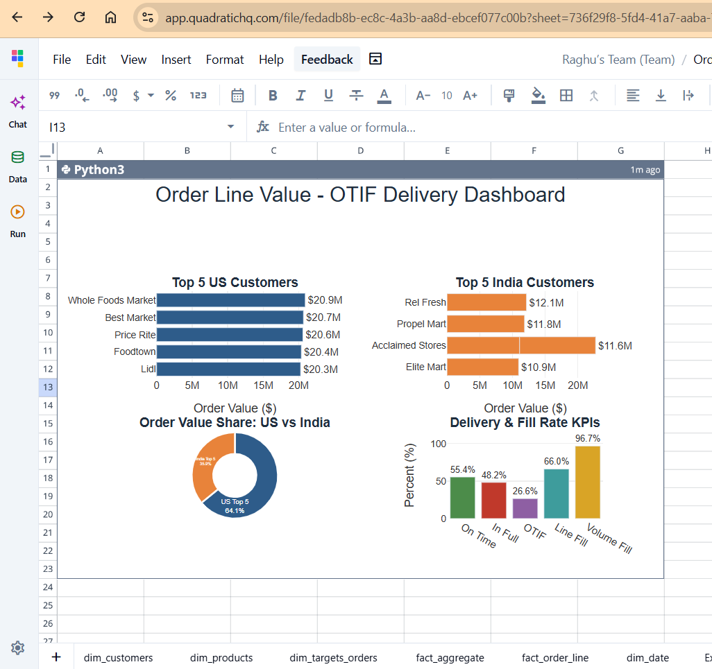
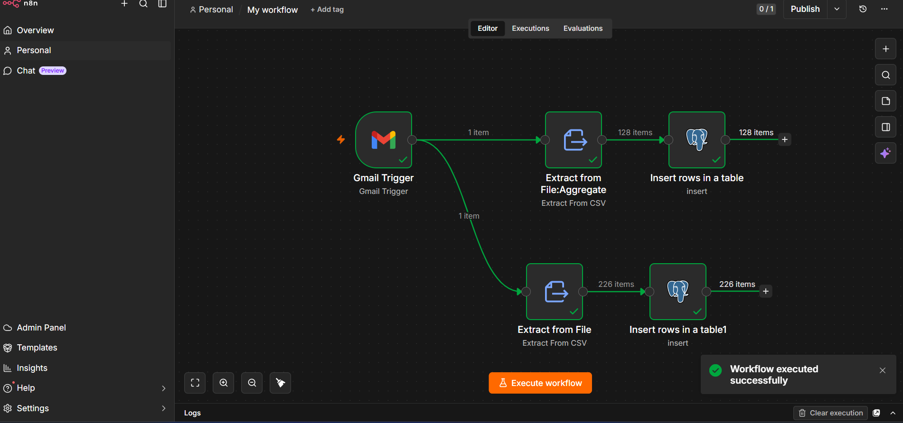
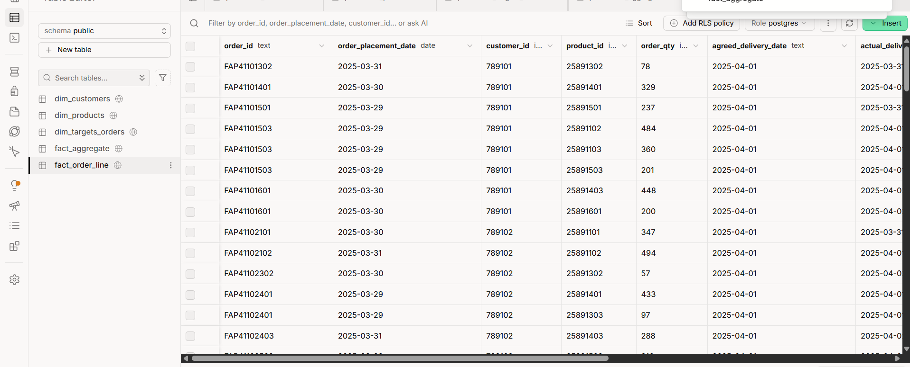

# 📦 AI-Powered Supply Chain Analytics & Workflow Automation

### End-to-End Data Pipeline using n8n, Supabase (PostgreSQL) & Quadratic

[](LICENSE)

An end-to-end Supply Chain Analytics solution that automates the ingestion, transformation, storage, and analysis of daily sales and delivery data — from an inbox to an executive dashboard, with no manual data handling in between.

n8n monitors Gmail for incoming daily sales reports, extracts and validates CSV attachments, and loads them into **Supabase PostgreSQL**. **Quadratic** then connects to Postgres to perform AI-assisted transformation, calculate supply chain KPIs, and produce the final dashboards.



## Why This Project

Organizations receive daily sales orders from multiple customers across regions. Processing these files manually is slow and error-prone, and it delays reporting. This project automates that entire path and answers a concrete set of business questions (revenue loss from undelivered orders, OTIF discrepancies by customer, delivery bottlenecks by category) directly from the data — see [`docs/03_Business_Questions.md`](docs/03_Business_Questions.md) and the results in [`docs/07_Business_Insights.md`](docs/07_Business_Insights.md).

## Architecture

```
        CSV Sales Files (email attachment)
                     │
                     ▼
            Gmail Inbox (Daily Sales)
                     │
                     ▼
           n8n Workflow Automation
                     │
      ┌──────────────┴──────────────┐
Data Validation              Data Transformation
      └──────────────┬──────────────┘
                     ▼
         Supabase PostgreSQL Database
                     │
      ┌──────────────┼──────────────┐
Fact Tables    Dimension Tables  Target Tables
                     │
                     ▼
          Quadratic Analytics Workbook
                     │
      ┌──────────────┼──────────────┐
 Date Table   Exchange Rate Table  Fact Summary
                     │
                     ▼
             KPI Calculation Layer
                     │
                     ▼
         Business Insights & Dashboards
```

## Tech Stack

| Category | Technology |
|---|---|
| Workflow Automation | [n8n](https://n8n.io) |
| Email Integration | Gmail API |
| Database | [Supabase](https://supabase.com) (PostgreSQL) |
| Analytics | [Quadratic](https://www.quadratichq.com) |
| Programming | Python (AI-assisted, within Quadratic) |
| Data Format | CSV |
| Version Control | Git & GitHub |

## Key Results

| KPI | Value |
|---|---|
| Total Orders | 3,380 |
| Total Order Lines | 12,390 |
| Line Fill Rate | 66.0% |
| Volume Fill Rate | 96.7% |
| On-Time Delivery % | 55.4% |
| In-Full Delivery % | 48.2% |
| **OTIF %** | **26.6%** |

**Headline finding:** Volume Fill Rate is strong, but **On-Time Delivery is the primary drag on OTIF**, not incomplete shipments. Full analysis: [`docs/07_Business_Insights.md`](docs/07_Business_Insights.md) · Recommendations: [`docs/08_Recommendations.md`](docs/08_Recommendations.md).

## Repository Structure

```
Supply-Chain-AI-Automation/
├── README.md
├── LICENSE
├── .gitignore
├── .gitattributes
├── workflow.json               ← importable n8n workflow
│
├── data/                       ← sample CSV dataset (dimension + fact tables)
├── sql/                        ← schema, load notes, KPI & analytical queries, views
├── dashboards/                 ← KPI report & Quadratic dashboard write-ups
├── images/                     ← dashboard and pipeline screenshots
├── docs/                       ← full project documentation
│   ├── 01_Project_Overview.md
│   ├── 02_Business_Problem.md
│   ├── 03_Business_Questions.md
│   ├── 04_Data_Dictionary.md
│   ├── 05_Methodology.md
│   ├── 06_Data_Model.md
│   ├── 07_Business_Insights.md
│   ├── 08_Recommendations.md
│   └── 09_Future_Enhancements.md
└── reference/                  ← supplementary reference material
```

## Quick Start

1. **Set up the database:** create the schema with [`sql/01_create_tables.sql`](sql/01_create_tables.sql), then load the sample data from [`data/`](data).
2. **Set up n8n:** install n8n locally or via cloud, then import [`workflow.json`](workflow.json) directly into your workspace.
3. **Connect Gmail:** in the imported workflow, open the Gmail Trigger node and attach your own Gmail OAuth credential (Google Cloud Console → OAuth Client → n8n Gmail node).
4. **Build the dashboard:** connect Quadratic to your Supabase Postgres instance using the connection string from step 1 — full walkthrough in [`dashboards/Quadratic_Dashboard.md`](dashboards/Quadratic_Dashboard.md).
5. **Explore the KPIs:** run [`sql/03_kpi_queries.sql`](sql/03_kpi_queries.sql) and [`sql/04_analytical_queries.sql`](sql/04_analytical_queries.sql) directly in Supabase's SQL Editor.

## Database Schema

Star schema with 2 fact tables and 5 dimension/supporting tables — full detail in [`docs/04_Data_Dictionary.md`](docs/04_Data_Dictionary.md) and [`docs/06_Data_Model.md`](docs/06_Data_Model.md).

**Fact tables:** `fact_order_line`, `fact_aggregate`
**Dimension tables:** `dim_customers`, `dim_products`, `dim_targets_orders`, `dim_date`, `exchange_rate`

## Screenshots

| n8n Workflow | Supabase Table Editor |
|---|---|
|  |  |

More in [`images/`](images) and referenced throughout [`docs/`](docs).

## Documentation Index

| Doc | Covers |
|---|---|
| [01 — Project Overview](docs/01_Project_Overview.md) | What this project is and why |
| [02 — Business Problem](docs/02_Business_Problem.md) | The problem being solved |
| [03 — Business Questions](docs/03_Business_Questions.md) | Questions this project answers |
| [04 — Data Dictionary](docs/04_Data_Dictionary.md) | Table & column reference |
| [05 — Methodology](docs/05_Methodology.md) | How the pipeline works, stage by stage |
| [06 — Data Model](docs/06_Data_Model.md) | Star schema & relationships |
| [07 — Business Insights](docs/07_Business_Insights.md) | Findings from the data |
| [08 — Recommendations](docs/08_Recommendations.md) | What to do about the findings |
| [09 — Future Enhancements](docs/09_Future_Enhancements.md) | Roadmap |

## Acknowledgements

This project was built as a self-directed, end-to-end supply chain analytics build — extending an initial practice brief into a fully documented, reproducible pipeline covering automated ingestion (n8n), storage (Supabase/PostgreSQL), and AI-assisted analysis and dashboarding (Quadratic).

## Author

**Mutha Raghu Vardhan**
Financial / Data Analyst — SQL · PostgreSQL · n8n · Supabase · Quadratic · Python · Business Analytics

📧 [raghuvardhan.mutha@gmail.com](mailto:raghuvardhan.mutha@gmail.com)
🔗 [LinkedIn](https://www.linkedin.com/in/raghuvardhanfinancialanalyst)

## License

MIT — see [LICENSE](LICENSE).

---

⭐ If you found this project useful, consider giving it a star.
