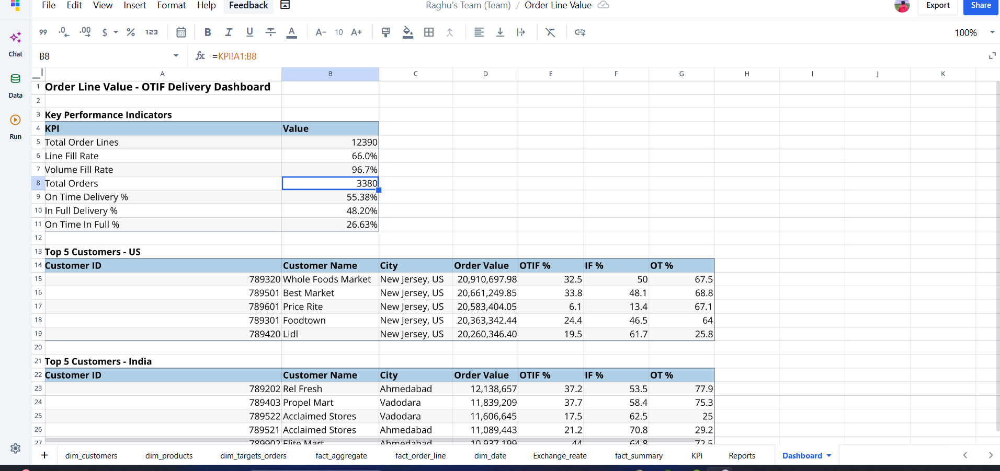

# 📊 KPI Report

## Overview

This report defines the KPIs used to evaluate supply chain performance — delivery efficiency, order fulfillment quality, and customer service — and shows the results from the current dataset.



## Results Snapshot

| KPI | Value |
|---|---|
| Total Orders | 3,380 |
| Total Order Lines | 12,390 |
| Line Fill Rate | 66.0% |
| Volume Fill Rate | 96.7% |
| On-Time Delivery % | 55.4% |
| In-Full Delivery % | 48.2% |
| OTIF % | 26.6% |

## KPI Definitions

### Total Orders
**Definition:** Total number of unique customer orders processed during the reporting period.
**Business Value:** Measures business volume.

### Total Order Lines
**Definition:** Total number of individual products ordered.
**Business Value:** Provides insight into operational workload.

### Line Fill Rate
**Definition:** Percentage of order lines delivered completely.
```
Delivered Order Lines / Total Order Lines × 100
```
**Business Value:** Measures fulfillment quality.

### Volume Fill Rate
**Definition:** Percentage of ordered quantity delivered.
```
Delivered Quantity / Ordered Quantity × 100
```
**Business Value:** Measures inventory availability.

### On-Time Delivery
**Definition:** Percentage of orders delivered on or before the agreed delivery date.
**Business Value:** Measures logistics performance.

### In-Full Delivery
**Definition:** Percentage of orders delivered with complete quantities.
**Business Value:** Measures warehouse performance.

### OTIF (On-Time In-Full)
**Definition:** Orders delivered both on-time **and** in-full.
```
Orders Delivered On-Time AND In-Full / Total Orders × 100
```
**Business Value:** The single most important supply chain KPI — combines timeliness and completeness.

## Dashboard Components

- Executive KPI Summary
- Customer Performance (US / India)
- Delivery Performance
- Revenue Analysis
- Product Performance
- Regional Comparison

## Business Impact

These KPIs help the organization improve customer satisfaction, monitor delivery performance, optimize inventory, reduce revenue loss, and improve overall supply chain efficiency.

## Conclusion

The dashboard gives management a centralized, single-source-of-truth view of operational performance. The current numbers point clearly to on-time delivery — not fill quantity — as the primary lever for improving OTIF; see [`../docs/07_Business_Insights.md`](../docs/07_Business_Insights.md) for the full analysis.

Queries backing these numbers: [`../sql/03_kpi_queries.sql`](../sql/03_kpi_queries.sql)
